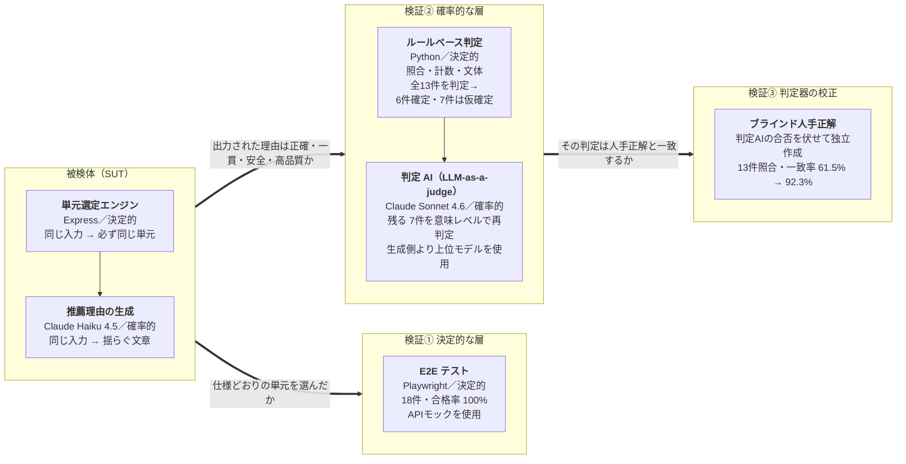

# AI 学習レコメンド機能の品質保証

[](https://github.com/nani9ashi/qa-portfolio-ai-recommender/actions/workflows/e2e-tests.yml)
[](https://github.com/nani9ashi/qa-portfolio-ai-recommender/actions/workflows/ai-quality-tests.yml)

中高生に「次に学ぶべき単元」を AI が提案する学習レコメンド機能を対象に、以下3つを一人称で完遂したプロジェクトです。

- ①実務同等のテストプロセス（要求分析 → テスト計画 → 設計 → 実行 → 完了報告。企画者・開発者との合意形成も両役を演じて GitHub Issue に記録）
- ②決定的なルールベース層への E2E 自動テスト 18 件（API モック・CI 品質ゲート）
- ③確率的な生成 AI 層への AI 出力品質テスト 13 件と、その合否を下す判定 AI（LLM-as-a-judge）そのものの検証

E2E 18 件（合格率 100%）と AI 出力品質テスト 13 件の計 31 ケースを設計・実行。判定器を**ルールベースから LLM-as-a-judge** へ改善して合格率 76.92% → 92.31%、その改善が「判定の甘さ」による見かけのものでないことを、ブラインドの人手正解との判定一致率 **61.54% → 92.31%** で裏付けています。

## 成果サマリ

| 項目 | 結果 |
|---|---|
| テストケース総数 | **31件**（E2E 18件 + AI 出力品質 13件） |
| E2E テスト | **合格率 100%**（`main` への push / PR で CI 自動実行） |
| AI 出力品質テスト | 合格率 **76.92% → 92.31%**（Phase 1: ルールベース判定 → Phase 2: LLM-as-a-judge 併用） |
| 判定 AI の人手正解との一致率 | **61.54% → 92.31%**（合格率の改善が測定器の改善を伴うことを確認） |
| 対応した Issue | **8件**（5件 Closed、3件は v2 改善対象として Open） |
| 戦略上の判断 | 判定 AI の合否を伏せた**ブラインド人手正解**を検証の終端に置き、判定器自身による自己検算の循環を遮断 |

テスト戦略・実行結果・リリース判定を**1つだけ読むなら [テスト完了レポート](./docs/test-report.md)**、QA ドキュメント一式の入口は [docs/](./docs/)（末尾「ドキュメント」節）です。

## テスト対象と構成: 何を保証するのか

SUT は、学年・理解済み単元・苦手単元を入力すると、次に学ぶべき単元を最大3件、推薦理由とあわせて提示するアプリです。

| 入力画面 | 推薦結果画面 |
|---|---|
|  |  |

内部は **2層アーキテクチャ**です。ルールベースの単元選定エンジン（決定的）が推薦単元を確定し、生成 AI（Claude API）が推薦理由テキストを生成します（確率的）。この分離を Node.js + Express のバックエンドで実装しています。

| 区分 | 中身 | 入口 |
| :--- | :--- | :--- |
| **作ったもの（SUT）** | レコメンド画面 + Express バックエンド（決定的 / 確率的の2層） | [src/](./src/)・[backend/](./backend/) |
| **品質保証の過程（QA 成果物）** | 企画書〜テスト完了レポート + 評価戦略マップ、E2E 18件、AI 出力品質テスト 13件、CI | [docs/](./docs/)・[tests/](./tests/) |

```text
root/
├── .github/workflows/  # CI設定（E2E=push毎自動 / AI品質=手動trigger の2ワークフロー）
├── src/・backend/      # SUT: フロントエンド + Express バックエンド（2層アーキテクチャ）
├── tests/              # E2E（Playwright）・AI出力品質（pytest）
└── docs/               # QA成果物（企画書・テスト計画・設計・完了レポート・評価戦略マップ）
```

## テスト戦略: 検証の三段チェーン

この SUT で担保したい価値は「**AI の提案を、生徒がそのまま信じてよいこと**」です。実在しない単元を勧めない・前提関係を誤らない・不適切な表現を出さない——ところが推薦理由テキストは確率的に揺らぐため、**入力に対する期待値表が書けません**。合否を一意に決められない出力に、それでも根拠を持って合否を言うにはどうするか。

答えとして、テストを対象の性質で分け、さらに「検証する側」自身を次の検証対象にする三段のチェーンを組みました。**図は左から右へ、検証の矛先が一段ずつ深くなっていきます。**



| 層 | 件数 | 実装 | 性質 | 実行 | 結果 |
|---|---|---|---|---|---|
| E2E テスト | 18件 | Playwright + TypeScript | 決定的・API モック | push / PR で CI 自動実行 | 合格率 100% |
| AI 出力品質テスト | 13件 | Python + pytest | 確率的・実 Claude API | `workflow_dispatch` 手動実行（コスト管理） | 合格率 76.92% → 92.31% |
| 判定器の校正 | 13件照合 | ブラインド人手正解 | 独立・一回限りの照合 | 判定 AI のプロンプト調整完了後に一度だけ | 一致率 61.54% → 92.31% |

- **検証①（E2E）**: 単元選定は決定的なので、仕様どおりの単元が選定されることを期待値で判定します。API モックによりコストゼロで、push のたびに**変更がユーザー体験を壊していないかを機械的に確認**します（上部の緑バッジ）。
- **検証②（AI 出力品質）**: 推薦理由は合否を一意に決められないため、[test-plan.md](./docs/test-plan.md) §5 で定義した品質メトリクス（正確性 / 一貫性 / 安全性 / 品質）で評価します。ハルシネーション検出（生成された単元名の実在リスト照合）・前提関係の妥当性・文体統一など、「AI らしい品質課題」を構造化して検証します。
- **検証③（判定器の校正）**: 合否を下す判定 AI 自体が間違っていれば、①②の結果はすべて砂上になります。だから判定器を検証のチェーンの終端にせず、**判定 AI の合否を伏せて独立に作った人手正解**と突き合わせました。この設計の帰結は次節のとおりです。


## 結果: 合格率の上昇を「判定一致率」で裏付けた

判定設計を Phase 1（ルールベース判定）から Phase 2（LLM-as-a-judge 併用）へ見直し、**合格率が 76.92% → 92.31% に上昇**しました。ただし合格率は判定を甘くするだけでも上がるため、これだけでは測定器が正しくなったと言えません。

そこで判定 AI の判定が**人手正解と一致した割合（判定一致率）を計測すると、61.54% → 92.31% へ同じく上昇**していました。判定 AI がルールベースの判定から動かした4件はいずれも人手正解と一致し、残る不一致は、ルール・LLM の**両層が見逃した 1 件（AI-A-003）の発見**につながりました。合格率と一致率がともに上がったことで、Phase 2 の改善は「判定を甘くした」結果ではないと裏付けられました（詳細: [テスト完了レポート](./docs/test-report.md) §4.4）。

なお、判定 AI のプロンプト調整中は人手正解を参照せず、**調整完了後に一度だけ照合**しています（調整対象 13 件への過適合による「見かけの一致率」を避けるため）。

判定は、ルール単独 / LLM 合意による合格 / LLM による合格格上げ / LLM による不合格格下げの 4 経路に分類して可視化しています。経路の詳細と Phase 1 → Phase 2 の差分は [tests/ai-quality/README.md](./tests/ai-quality/README.md) を参照。

## 仕様の曖昧さと合意形成

仕様（企画書）が最初から完璧であることは稀です。曖昧な箇所は「**自分で勝手に解釈せず、企画者・開発者と合意する**」プロセスを踏み、その経緯を GitHub Issue 上に記録しています。

| 関心 | 参照先 |
|---|---|
| v1 リリース判定の議論 | [Issue #9](../../issues/9)（AC-1〜AC-5 の合格確認と PdM 承認） |
| 仕様の曖昧さへの対処 | [Issue #3](../../issues/3) / [Issue #4](../../issues/4)（初版で受け入れるか / 改善課題として残すか） |
| 開発者とのコミュニケーション | [Issue #1](../../issues/1) / [Issue #2](../../issues/2)（UI バグ修正と構造改善の議論） |

## スコープ外としたもの

意図的にスコープ外とした項目を明示します。やらない理由を残すこと自体も品質活動の一部だと考えています。境界設計の全体は **[評価戦略マップ（eval-strategy.md）](./docs/eval-strategy.md)** に、生成 AI アプリの層モデルへの対応表として固定しています。

- **基盤モデル内部の品質**: ML / ベンダの領分。QA はモデル選定理由の記録と、モデル差し替え時の回帰テストに責任を持つ、という境界を引いています。
- **RAG（学習指導要領）拡張**: 検索評価・忠実性評価まで**設計済み・未実装**。「評価ハーネスに新しい評価対象が増えるか」を採否基準とし、増えない拡張（チューニング層の導入等）は棄却しました。
- **判定一致率の限界**: 同一 13 件・単一評価者に対する点推定です。新規に生成した出力での再検証を次フェーズの課題として明示しています。

## 技術スタック

| 区分 | 技術・ツール | 用途 |
| :--- | :--- | :--- |
| SUT | Node.js + Express | バックエンド（決定的 / 確率的の2層分離） |
| SUT | HTML / CSS / JavaScript | フロントエンド（レコメンド画面） |
| SUT | Claude Haiku 4.5（Claude API） | 推薦理由テキストの生成（確率的な層） |
| QA | Playwright + TypeScript | E2E テスト自動化（API モック・CI 品質ゲート） |
| QA | Python + pytest | AI 出力品質テスト（実 Claude API） |
| QA | Claude Sonnet 4.6（LLM-as-a-judge） | AI 出力の合否判定（判定器。人手正解で校正） |
| 共通 | GitHub Actions | E2E（push / PR 毎）と AI 品質（手動 trigger）の2ワークフロー・証跡保存 |

## 動作確認

CI で push / PR 時に **E2E 18 件**を自動実行（上部バッジ参照）。AI 出力品質テストは実 API を使うため `workflow_dispatch` の手動実行です。手元で動かす場合の手順（依存パッケージ・API キー・起動・テスト実行）は **[docs/setup.md](./docs/setup.md)** に集約しています。

## ドキュメント

読む順は test-plan → test-design → test-report を推奨します。

| ファイル | 内容 | 想定読者 |
|---|---|---|
| [prd.md](./docs/prd.md) | 企画書: どんな機能を作るか | 企画者・開発者・QA |
| [test-plan.md](./docs/test-plan.md) | テスト戦略: どうやってテストするか | QA・マネージャー |
| [test-design.md](./docs/test-design.md) | テストケース設計: 具体的に何を確認するか | QA・開発者 |
| [test-report.md](./docs/test-report.md) | テスト完了レポート: 実行結果と品質判定 | マネージャー・採用担当者・QA |
| [eval-strategy.md](./docs/eval-strategy.md) | 評価戦略マップ: どの層で・何を・どう評価するか（配置の設計判断と RAG 拡張の評価設計） | QA・マネージャー |

## 作者

**仁後慎太郎**（[GitHub](https://github.com/nani9ashi)）

施設警備・個別指導塾・引越の現場で「使う側」として品質の不全を体験したことを出発点に、品質保証を主題として作品を作っています。JSTQB Foundation Level 保有。**「担保したい価値」を問い続ける**ことを QA の軸にしています。

<!-- ポートフォリオサイト公開後: 全作品を束ねるサイトへのリンクをここに追加 -->

## ライセンス

本プロジェクトは MITライセンス に基づいて公開されています。利用条件については [LICENSE](LICENSE) ファイルをご参照ください。
