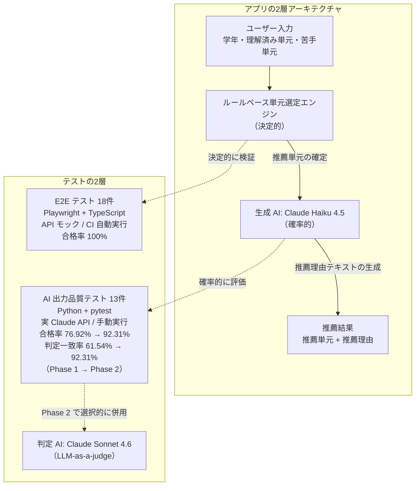

# AI 学習レコメンド機能の品質保証

*QAポートフォリオ3部作の②（戦略・AI編）。シリーズ全体は末尾「関連作品」を参照。*

中高生に「次に学ぶべき単元」を AI が提案する学習レコメンド機能を題材に、**確率的に揺らぐ生成 AI プロダクトの品質保証**を一人称で設計・実行したプロジェクトです。要求分析 → テスト計画 → テスト設計 → テスト実行 → 完了報告の実務プロセスを 1 人で再現し、企画者・開発者との合意形成も（両役を自分で演じて）GitHub Issue 上に記録しています。**主役は QA 成果物**で、アプリは品質保証の対象（SUT）を自前で用意したものです。

題材には原体験があります。個別指導塾の講師として、「次に何をやるか」の提示が生徒の伸びを左右する場面を何度も見てきました。その提案を生成 AI に任せるなら、揺らぐ出力を信じてよい根拠は誰が作るのか——講師として自分が担っていた判断を AI に渡すとしたら何を検証するかを、QA として設計しました。

**結果として、E2E 18 件（合格率 100%）と AI 出力品質テスト 13 件の計 31 ケースを設計・実行。判定器をルールベースから LLM-as-a-judge へ改善し、合格率 76.92% → 92.31%、人手正解との判定一致率 61.54% → 92.31% を達成**——合格率の上昇が「判定の甘さ」による見かけの改善でないことまで裏付けました。

## 結論サマリ

| 項目 | 結果 |
|---|---|
| テストケース総数 | **31件**（E2E 18件 + AI 出力品質 13件） |
| E2E テスト | **合格率 100%**（CI で毎 push 自動実行） |
| AI 出力品質テスト | 合格率 **76.92% → 92.31%**（Phase 1 → Phase 2） |
| 判定 AI の人手正解との一致率 | **61.54% → 92.31%**（合格率の改善が測定器の改善を伴うことを確認） |
| 対応した Issue | **8件**（5件 Closed、3件は v2 改善対象として Open） |

テスト戦略・実行結果・リリース判定は **[テスト完了レポート](./docs/test-report.md)** に8章で網羅しています。**1つだけ読むならこれを推奨します。**

## テスト対象と構成: 何を保証するのか

SUT は、学年・理解済み単元・苦手単元を入力すると、次に学ぶべき単元を最大3件、推薦理由とあわせて提示するアプリ（動作モック）です。

| 入力画面 | 推薦結果画面 |
|---|---|
|  |  |

内部は **2層アーキテクチャ**です。ルールベースの単元選定エンジン（決定的）が推薦単元を確定し、生成 AI（Claude API）が推薦理由テキストを生成する（確率的）——この分離を Node.js + Express のバックエンドで実装しています。

| 区分 | 中身 | 場所 |
| :--- | :--- | :--- |
| **作ったもの（SUT）** | レコメンド画面（動作モック）＋ Express バックエンド（決定的/確率的の2層） | [src/](./src/)・[backend/](./backend/) |
| **保証したもの（QA 成果物）** | 企画書〜テスト完了レポートのドキュメント4点、E2E 18件、AI 出力品質テスト 13件、CI | [docs/](./docs/)・[tests/](./tests/)・[.github/workflows/](./.github/workflows/) |

## 課題: 期待値表が書けない世界をどう検証するか

AI が「実在しない単元」を勧めてしまえば、生徒は混乱します。エラー時の案内が不親切なら、ユーザーは離脱します。**ユーザーが気づきにくい部分にこそ品質課題が潜む**——ここまでは通常の QA と同じです。

問題は、推薦理由テキストが確率的に揺らぐため、**入力に対する期待値表が書けない**ことです（この点が、期待値を厳密に書き下せた前作①との対比になります）。そこで本作では、決定的な部分は決定的な手段で、確率的な部分は確率的な手段で検証する——とテストを対象の性質で分けることを戦略の中心に置きました。

## テストの2層設計

アプリの2層アーキテクチャに対応させる形で、テストも2層に分けて設計しています。

| 層 | 件数 | 実装 | 性質 | 実行 | 合格率 |
|---|---|---|---|---|---|
| E2E テスト | 18件 | Playwright + TypeScript | 決定的・API モック | `main` への push および `main` 向け PR で CI 自動実行 | 100% |
| AI 出力品質テスト | 13件 | Python + pytest | 確率的・実 Claude API | `workflow_dispatch` による手動実行（コスト管理のため） | 76.92% → 92.31%（Phase 1 → Phase 2） |

- **ルールベース部分（E2E）**: 単元選定ロジックは決定的なので、仕様どおりの単元が選定されることを E2E で検証します。API モックを使うためコストはかからず、push / PR のたびに自動実行——**人手に頼らず、変更がユーザー体験を壊していないかを毎回機械的に確認**する仕組みです（上部の緑バッジが現時点の通過を示します）。
- **生成 AI 部分（AI 出力品質テスト）**: 推薦理由は合否を一意に決められないため、[test-plan.md](./docs/test-plan.md) §5 で定義した品質メトリクス（正確性／一貫性／安全性／品質）で評価します。ハルシネーション検出・前提関係の妥当性・文体統一など、E2E では捉えにくい「AI らしい品質課題」を構造化して検証します。

## 結果: 合格率の上昇を「判定一致率」で裏付けた

AI 出力品質テストでは、判定設計を Phase 1（ルールベース判定）から Phase 2（LLM-as-a-judge 併用）へ見直し、**合格率が 76.92% → 92.31% に上昇**しました。ただし合格率は判定を甘くするだけでも上がるため、これだけでは測定器である判定 AI が正しくなったとは言えません。

そこで判定 AI の判定が**人手で独立に定めた正解と一致した割合（判定一致率）**を計測すると、**61.54% → 92.31% へ同じく上昇**していました。判定 AI がルールから動かした4件はいずれも人手正解と一致し、残る不一致はルール・LLM の両層が見逃した AI-A-003 の1件のみでした。

合格率と一致率がともに上がったことで、Phase 2 の改善は「判定を甘くした」結果ではなく判定 AI が実際に正しくなった結果だと裏付けられました。判定 AI 自身でその正しさを検算する循環を避けるため、判定 AI の合否を伏せた**ブラインドの人手正解**を終端に置いて突き合わせています——この設計があって初めて、この検証と AI-A-003 の発見が可能になりました（詳細: [テスト完了レポート](./docs/test-report.md) §4.4）。

なお、判定 AI のプロンプト調整中は人手正解を参照せず、**調整が完了してから一度だけ照合**しています（調整対象の 13 件へ過適合した「見かけの一致率」を避けるため）。それでもこの一致率は同一 13 件・単一評価者に対する点推定であり、**新規に生成した出力での再検証を次フェーズの課題**として明示しています。

判定は、ルール単独・LLM 合意による合格・LLM による合格格上げ・LLM による不合格格下げの 4 経路に分類して可視化しています。経路の詳細と Phase 1 → Phase 2 の差分は [tests/ai-quality/README.md](./tests/ai-quality/README.md) を参照。

## 仕様の曖昧さと合意形成

仕様（企画書）が最初から完璧であることは稀です。曖昧な箇所は「**自分で勝手に解釈せず、企画者・開発者と合意する**」プロセスを踏み、その経緯を GitHub Issue 上に記録しています。相手と認識を合わせてから前に進めるこの動き方は、企画・開発と協働する QA の基本動作だと考えています。

| 関心 | 参照先 |
|---|---|
| v1 リリース判定の議論 | [Issue #9](../../issues/9)（AC-1〜AC-5 の合格確認と PdM 承認） |
| 仕様の曖昧さへの対処 | [Issue #3](../../issues/3) / [Issue #4](../../issues/4)（初版で受け入れるか / 改善課題として残すか） |
| 開発者とのコミュニケーション | [Issue #1](../../issues/1) / [Issue #2](../../issues/2)（UI バグ修正と構造改善の議論） |

## 動かし方

セットアップ手順（依存パッケージ・API キー・起動・テスト実行）は [docs/setup.md](./docs/setup.md) を参照してください。

## ドキュメント

QA プロセスの成果物一式は [docs/](./docs/) にあります。読む順は test-plan → test-design → test-report を推奨します。

| ファイル | 内容 | 想定読者 |
|---|---|---|
| [prd.md](./docs/prd.md) | 企画書: どんな機能を作るか | 企画者・開発者・QA |
| [test-plan.md](./docs/test-plan.md) | テスト戦略: どうやってテストするか | QA・マネージャー |
| [test-design.md](./docs/test-design.md) | テストケース設計: 具体的に何を確認するか | QA・開発者 |
| [test-report.md](./docs/test-report.md) | テスト完了レポート: 実行結果と品質判定 | マネージャー・採用担当者・QA |

## 関連作品（QAポートフォリオ3部作）

「品質保証で何を担うか」——作り込む・設計する・判断する——を段階的に広げた 3 部作の②です。

- **[① 技術・基礎編：チケット管理システム](https://github.com/nani9ashi/qa-portfolio-ticket-system)** — 期待値を厳密に書き下せる決定的な業務システムを対象に、JSTQB 準拠のプロセスとテストピラミッド（手動・API・E2E）で品質を作り込む。
- **本リポジトリ｜② 戦略・AI 編** — 確率的に揺らぐ生成 AI プロダクトを対象に、テストを 2 層で設計し、判定 AI（測定器）自体の正しさまで人手正解との照合で検証する。
- **[③ 評価・判断編：既存物体検出モデル](https://github.com/nani9ashi/qa-portfolio-object-detection)** — 自分で作っていない調達候補モデルを外から評価し、事前に固定した基準に対して導入可否（結論は No-Go）を判断する。

3 作を貫く主題は「**物差し（期待値・判定器・受け入れ基準）そのものは正しいか**」という問いです。

## 作者

**仁後慎太郎**（[GitHub](https://github.com/nani9ashi)）

施設警備・個別指導塾・引越の現場で「使う側」として品質の不全を体験したことを出発点に、品質保証を主題として作品を作っています。JSTQB Foundation Level 保有。哲学のバックグラウンドから、**「受け入れ基準＝物差しそのものは正しいか」を問い直す**ことを QA の軸にしています。

<!-- ポートフォリオサイト公開後: 全作品を束ねるサイトへのリンクをここに追加 -->

## ライセンス

本プロジェクトは MITライセンス に基づいて公開されています。利用条件については [LICENSE](LICENSE) ファイルをご参照ください。
