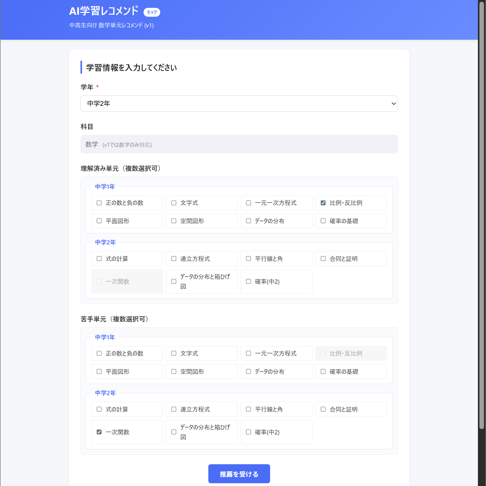
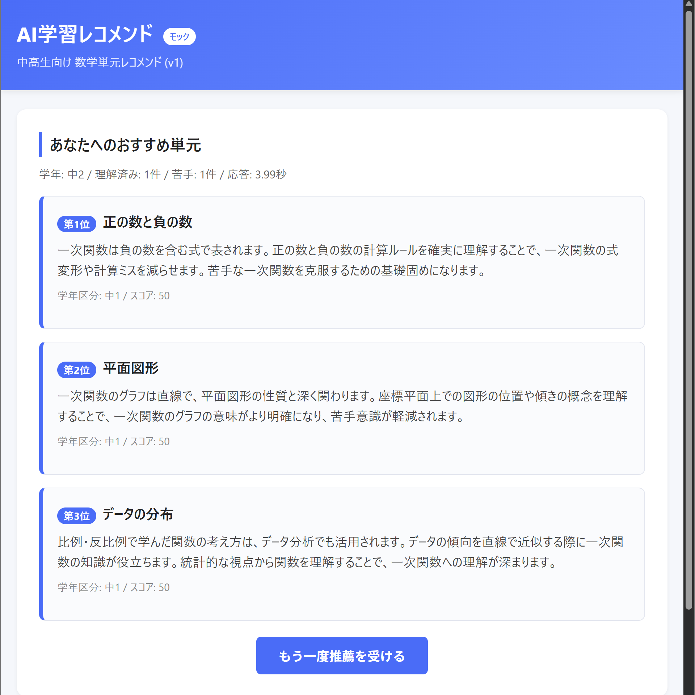
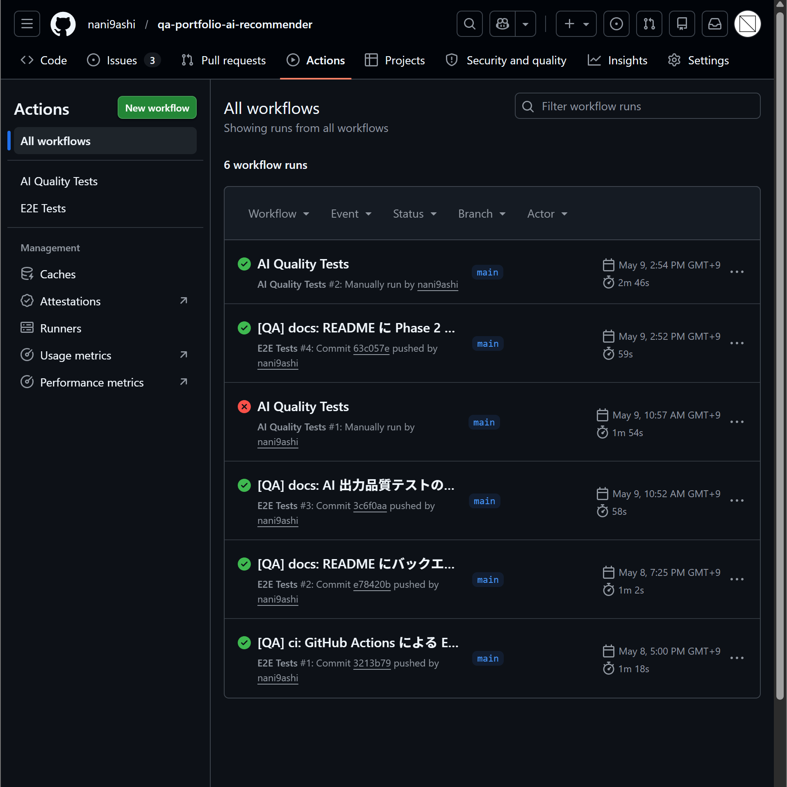
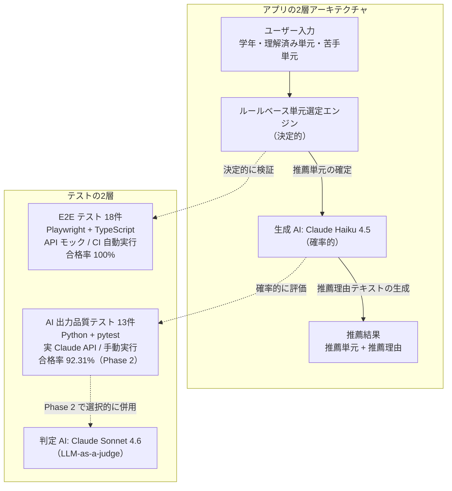
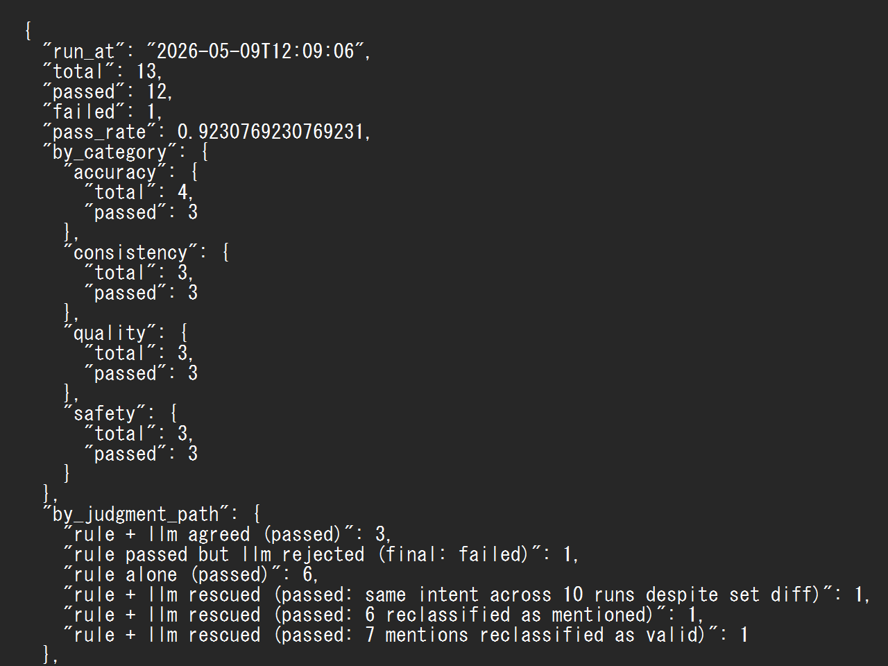

# AI 学習レコメンド機能：プロダクト品質ポートフォリオ

[](https://github.com/nani9ashi/qa-portfolio-ai-recommender/actions/workflows/e2e-tests.yml)
[](https://github.com/nani9ashi/qa-portfolio-ai-recommender/actions/workflows/ai-quality-tests.yml)

中高生向け学習サービスを題材に、**AI を組み込んだプロダクトを「現場で本当に使える形」に落とし込むには何が必要か** をテーマにしたポートフォリオです。

技術的な深さ以上に、「**品質を作るために何を考え、誰とどう連携したか**」を見ていただける構成になっています。

---

## 数字で見る成果

- **テストケース総数: 31件**（E2E テスト 18件 + AI 出力品質テスト 13件）
- **E2E テスト合格率: 100%**（CI で自動実行、push のたびに実行）
- **AI 出力品質テスト合格率: 92.31%**（Phase 2 ベースライン、Phase 1 の 76.92% から +15.4pt 改善）
- **対応した Issue: 8件**（5件 Closed、3件は v2 改善対象として Open）
- **採用技術**: Playwright + TypeScript / Python + pytest / GitHub Actions / Claude API (Haiku 4.5 + Sonnet 4.6) / Express

---

## 最初に読んでほしいドキュメント

このポートフォリオの**最終成果物**は [テスト完了レポート](./docs/test-report.md) です。テスト戦略・実行結果・リリース判定までを8章にわたって網羅しています。

**1ドキュメントだけ読まれる場合、これを推奨します。**

---

## ポートフォリオシリーズ

本リポジトリは、QA エンジニアとして取り組んでいる**ポートフォリオシリーズの一つ**です。**戦略的な品質保証・関係者連携・AI プロダクトの品質設計** を中心テーマとしており、ほかにチケット管理アプリのリポジトリがあります。

| リポジトリ | テーマ | 主要技術 |
|---|---|---|
| **本リポジトリ** [qa-portfolio-ai-recommender](https://github.com/nani9ashi/qa-portfolio-ai-recommender) | AI 学習レコメンド機能の品質保証（戦略・関係者連携・AI 品質） | Playwright / Python+pytest / Claude API / GitHub Actions |
| [qa-portfolio-ticket-system](https://github.com/nani9ashi/qa-portfolio-ticket-system) | BtoB チケット管理システムの品質保証（QA エンジニアの技術的基礎） | Django / Playwright / pytest / GitHub Actions |

両リポジトリは「**学習の深化の軌跡**」として相互に補完する関係です。チケット管理ポートフォリオで CI/CD 構築・E2E 自動化・JSTQB 準拠のドキュメンテーションを基礎として習得した上で、本リポジトリではより深いテーマに踏み込んでいます。

---

## このポートフォリオで意識した4つの観点

QA エンジニアの実務プロセス (要求分析 → テスト計画 → テスト設計 → テスト実行) を1人で再現しながら、次の4つの観点を意識して取り組みました。

- **ユーザーや現場で何が起きるかを構造的に想定する視点**
- **曖昧な仕様を関係者と対話しながら明確にする力**
- **問題を再現可能な形に分解し、開発者と協働する姿勢**
- **継続的に品質を担保するための仕組みを作り込む実践**

これらは QA 職に留まらず、**プロダクトを現場で機能させる役割全般** に共通する素養だと考えています。

---

## このリポジトリは何か

中高生に「次に学ぶべき単元」を AI が提案するアプリ (動作モック) と、それを **どうテストして安心して使える状態にするか** という一連の作業をまとめたものです。

### アプリの実行例

| 入力画面 | 推薦結果画面 |
|---|---|
|  |  |

学年・理解済み単元・苦手単元を入力すると、AI が次に学ぶべき単元を最大3件、推薦理由とあわせて提示します。

---

## どの職種の方にも見ていただける3つのポイント

このプロジェクトを読み解くポイントを、テストや QA に詳しくない方にもわかりやすい形で3つに整理しました。

### 1. ユーザー視点での品質保証

AI が「実在しない単元」を勧めてしまえば、生徒は混乱します。エラー時のメッセージが不親切だと、ユーザーは離脱します。**ユーザーが気づきにくい部分にこそ品質課題が潜んでいる** という考えのもと、画面の振る舞い・エラー時の案内・AI の出力品質を多角的に検証する設計を行っています。

### 2. 関係者を巻き込む力

仕様 (企画書) が最初から完璧であることは稀です。曖昧な箇所は「**自分で勝手に解釈せず、企画者・開発者と合意する**」プロセスを踏み、その経緯を GitHub の Issue 上に記録しています。

[Issue #3](../../issues/3) と [Issue #4](../../issues/4) では、現状の挙動を「初版で受け入れるか / 改善課題として残すか」について相談しながら判断した経緯を記録しています。

### 3. 継続的な品質保証の仕組み化

このリポジトリにコードが変更されると、自動的に18件の E2E テストが裏で実行されます。**人手による確認に頼らず、変更がユーザー体験を壊していないかを毎回機械的に検証** する仕組みです。



ページ上部の緑色のバッジ「E2E Tests passing」が、**現時点でテストがすべて通過していること** を示しています (赤に変わっていれば、どこかで問題が発生しているサインです)。

AI 出力品質テストはコスト管理のため手動実行ですが、こちらも GitHub Actions ワークフローとして整備されています。

---

## テストの2層構造

このポートフォリオでは、**アプリの2層アーキテクチャ（決定的なルールベースと、確率的な生成 AI）に対応させる形で、テストも2層に分けて設計しています**。決定的な部分は決定的な手段で、確率的な部分は確率的な手段で検証する、という考え方です。



| 層 | 件数 | 実装 | 性質 | 実行 | 合格率 |
|---|---|---|---|---|---|
| E2E テスト | 18件 | Playwright + TypeScript | 決定的・API モック | `main` への push および `main` 向け PR で CI 自動実行 | 100% |
| AI 出力品質テスト | 13件 | Python + pytest | 確率的・実 Claude API | `workflow_dispatch` による手動実行（コスト管理のため） | 92.31%（Phase 2） |

- **ルールベース部分**: 入力に対する単元選定ロジックは決定的なので、E2E テストで仕様どおりの単元が選定されることを検証します。API モックを使うため API コストはかからず、`main` ブランチへの push と PR で毎回自動実行しています。
- **生成 AI 部分**: 推薦理由テキストは確率的に揺らぐため、合否を一意に決められません。そこで [docs/test-plan.md](./docs/test-plan.md) §5 で定義した品質メトリクス（**推薦理由の文字数適合率**・**推薦理由のハルシネーション検出率**・**推薦理由が入力情報に言及している率**）と、後述の段階的判定で評価します。実 Claude API を使うため、コスト管理の観点から `workflow_dispatch` の手動トリガーに限定しています。

---

## このリポジトリの構成物

### アプリ (動作モック)
中高生向け数学学習レコメンド画面。学年・理解済み単元・苦手単元を入力すると、AI が次に学ぶべき単元を最大3件提案します。

### ドキュメント ([docs/](./docs/))

| ファイル | 内容 | 想定読者 |
|---|---|---|
| [prd.md](./docs/prd.md) | 企画書: どんな機能を作るか | 企画者・開発者・QA |
| [test-plan.md](./docs/test-plan.md) | テスト戦略: どうやってテストするか | QA・マネージャー |
| [test-design.md](./docs/test-design.md) | テストケース設計: 具体的に何を確認するか | QA・開発者 |
| [test-report.md](./docs/test-report.md) | テスト完了レポート: 実行結果と品質判定 | マネージャー・採用担当者・QA |

### E2E テスト ([tests/e2e/](./tests/e2e/))
Playwright + TypeScript で実装した 18件の自動テスト（全件パス）。実際にブラウザを操作してアプリの動作を検証します。

### AI 出力品質テスト ([tests/ai-quality/](./tests/ai-quality/))
Python + pytest で実装した、生成 AI 出力に特化した品質テスト 13ケース（正確性 / 一貫性 / 安全性 / 品質）。

ハルシネーション検出・前提関係の妥当性・文体統一など、E2E では捉えにくい「AI らしい品質課題」を構造化して検証します。

Phase 1（ルールベース判定）から Phase 2（LLM-as-a-judge）へ段階的に拡張し、合格率を 76.92% → 92.31% まで向上させました。



上のスクリーンショットは Phase 2 ベースラインの判定経路集計を表示しています。13件のテストの最終判定がどの経路で確定したかの内訳は以下の通りです。

| 経路 | 件数 | 該当テスト |
|---|---|---|
| ルール単独で合格 | 6 | AI-C-001 / AI-C-002 / AI-Q-001 / AI-Q-003 / AI-S-001 / AI-S-003 |
| ルール + LLM 合意で合格 | 3 | AI-A-001 / AI-A-003 / AI-A-004 |
| LLM が「同趣旨」と判定し合格に格上げ | 1 | AI-C-003 |
| LLM が「文脈言及あり」と再分類し合格に格上げ | 1 | AI-Q-002 |
| LLM が「未来言及として妥当」と再判定し合格に格上げ | 1 | AI-S-002 |
| LLM が判定基準を厳格化し不合格に格下げ | 1 | AI-A-002 |

ルール単独で済むテストには LLM を呼ばずコストを抑え、ルールでは判定しきれない箇所のみ LLM-as-a-judge を選択的に使う設計です。LLM は「合格への格上げ」と「不合格への格下げ」の双方向に作用しています。

詳細は [tests/ai-quality/README.md](./tests/ai-quality/README.md) を参照。

### 継続テスト基盤 ([.github/workflows/](./.github/workflows/))
GitHub Actions という仕組みを使い、コード変更が起きるたびに E2E テストを自動実行します。
AI 出力品質テストはコスト管理のため手動トリガー（`workflow_dispatch`）。

### バックエンド ([backend/](./backend/))
Node.js + Express で構築したサーバ。Anthropic Claude API 経由で推薦理由を動的生成します。
ルールベースの単元選定（決定的）と生成 AI による理由生成（確率的）を分離する2層アーキテクチャを実装しています。

---

## ローカルで動かしたい方へ

セットアップ手順 (依存パッケージ・APIキー・起動・テスト実行) は [docs/setup.md](./docs/setup.md) にまとめています。

最短コマンド:
- ブラウザで動作確認したい: `npm install && npm run start` → http://localhost:5173
- E2E テストを実行: `npx playwright test --config tests/playwright.config.ts`
- AI 出力品質テストを実行: 詳細は [docs/setup.md §5](./docs/setup.md#5-ai-出力品質テストの実行-python--実-claude-api) 参照

---

## v1 として受け入れた制約

### 単元マスタデータの二重管理

学年・単元名のマスタデータは以下の2箇所に存在します:
- [src/units.js](./src/units.js) （フロントエンド用）
- [backend/services/units.js](./backend/services/units.js) （バックエンド用）

学習指導要領のデータ更新時は両方を同期更新する必要があります。本実装は技術的負債として認識しており、将来的には ES Module 化による共通参照を検討します。

### AI 出力品質テストのコスト

実 Claude API を使用するため、フル実行で1回あたり約 $0.20 のコストが発生します（Phase 2 構成、Sonnet 4.6 を判定 AI として使用）。

CI ワークフローは `workflow_dispatch` の手動トリガー限定とし、無駄な実行コストを抑制しています。月数回の実行であれば、Anthropic の標準クレジットで十分賄える範囲です。

---

## 一連の流れ (実務ワークフローの再現)

```
1. 企画書 (PRD) を読む
   ↓
2. テスト戦略を立てる (テスト計画書)
   ↓
3. テストケースを設計する (テスト設計書)
   ↓
4. アプリと自動テストを実装する
   ↓
5. テストを CI で自動実行する仕組みを作る
   ↓
6. 開発者・企画者と Issue で議論しながら品質を作り込む
   ↓
7. テスト結果をレポートにまとめ、リリース判定を行う
```

実務では役割の異なる複数人で並走しますが、本リポジトリでは1人で再現するため、コミットメッセージの先頭に役割タグを付けて担当を可視化しています。

| タグ | 役割 |
|---|---|
| `[PdM]` | プロダクトマネージャー（企画） |
| `[Dev]` | 開発エンジニア（実装） |
| `[QA]` | QA エンジニア（テスト計画・設計・実装・レポート作成） |
| `[init]` | 初期セットアップ |

---

## 進捗

| 項目 | 状態 |
|---|---|
| 企画書・テスト計画書・テスト設計書 | 完成 |
| アプリ本体（フロントエンド） | 完成 |
| E2E テスト 18件 | 完成・全件パス |
| GitHub Actions による自動テスト | 完成 |
| バックエンド (Express) と Claude API 統合 | 完成 |
| AI 出力品質テスト Phase 1（ルールベース判定） | 完成・76.92% (10/13) |
| AI 出力品質テスト Phase 2（LLM-as-a-judge） | 完成・**92.31% (12/13)** |
| テスト完了レポート | 完成（[docs/test-report.md](./docs/test-report.md)） |

---

## リポジトリを読む順番

| こんな方には | おすすめの読み順 |
|---|---|
| 結果と判定を素早く見たい（推奨） | [docs/test-report.md](./docs/test-report.md)（テスト完了レポート） |
| v1 リリース判定の議論を見たい | [Issue #9](../../issues/9)（AC-1〜AC-5 の合格確認と PdM 承認） |
| 全体プロセスを把握したい | この README → [docs/test-plan.md](./docs/test-plan.md) → [docs/test-design.md](./docs/test-design.md) |
| 仕様の曖昧さへの対処を見たい | [Issue #3](../../issues/3) と [Issue #4](../../issues/4) |
| 開発者とのコミュニケーション例を見たい | [Issue #1](../../issues/1) と [Issue #2](../../issues/2)（UI バグ修正と構造改善の議論） |
| AI 出力品質課題への対処を見たい | [Issue #5](../../issues/5)・[Issue #6](../../issues/6)・[Issue #7](../../issues/7)（Phase 1 の構造的限界の発見と Phase 2 での解消） |
| LLM-as-a-judge による新規課題発見を見たい | [Issue #8](../../issues/8)（Phase 2 の判定厳格化により発見されたバックエンドプロンプトの精度課題） |
| 自動テストの実物を見たい（E2E） | [tests/e2e/normal.spec.ts](./tests/e2e/normal.spec.ts) |
| AI 出力品質テストの実物を見たい | [tests/ai-quality/README.md](./tests/ai-quality/README.md) → [tests/ai-quality/test_safety.py](./tests/ai-quality/test_safety.py) |
| バックエンドと Claude API 統合の実装を見たい | [backend/server.js](./backend/server.js) → [backend/services/claudePrompt.js](./backend/services/claudePrompt.js) |
| アプリの動作を見たい | [src/index.html](./src/index.html) をブラウザで開く |
| ローカルで動かしてみたい | [docs/setup.md](./docs/setup.md)（起動・テスト実行手順） |
| CI / 自動化の構築を見たい | [.github/workflows/e2e-tests.yml](./.github/workflows/e2e-tests.yml) と [.github/workflows/ai-quality-tests.yml](./.github/workflows/ai-quality-tests.yml) |

---

## 補足: テスト戦略の特徴

- **判定経路の可視化**: 各テストの最終判定がルール単独・LLM 合意・LLM による格上げ・LLM による格下げのどの経路で確定したかを `summary.json` の `by_judgment_path` に記録
- **メタ評価の準備**: 判定 AI の判定理由を JSONL 形式で完全保存し、後から目視レビュー可能な構造（`tests/ai-quality/results/*/llm_judge_traces/`）

---

## 作者

**仁後慎太郎**

「現場で本当に使えるプロダクトをどう作るか」に関心を持って学習を続けている社会人です。JSTQB Foundation Level 保有。塾講師や警備員としての経験と、哲学を専攻したバックグラウンドを持ち、**ユーザーや現場目線で仮説を立て、関係者と対話しながら品質を作り込む**スタイルで取り組んでいます。AI プロダクトをはじめとする新しい領域においても、**観察力と論理性**で価値を生み出すビジネスパーソンを目指しています。
