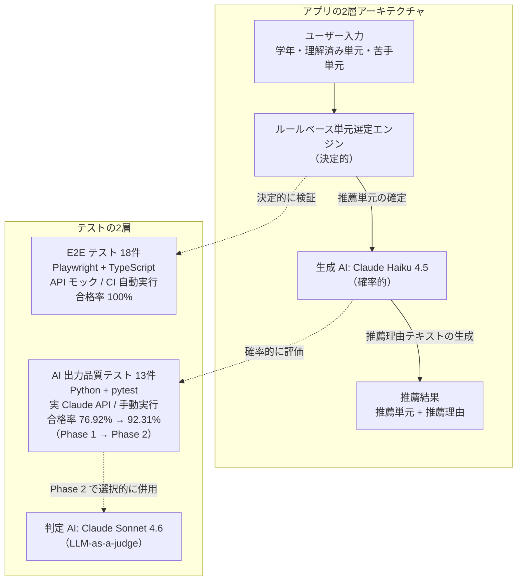

# AI 学習レコメンド機能：プロダクト品質ポートフォリオ

中高生向け学習サービスを題材に、AI を組み込んだプロダクトの品質を「**何を考え、誰とどう連携して作り込んだか**」という観点でまとめたポートフォリオです。

---

## 数字で見る成果

- **テストケース総数: 31件**（E2E テスト 18件 + AI 出力品質テスト 13件）
- **E2E テスト合格率: 100%**（CI で自動実行、push のたびに実行）
- **AI 出力品質テスト合格率: 76.92% → 92.31%**（Phase 1 → Phase 2）。これは SUT（Claude Haiku 4.5）の出力品質が向上したのではなく、ルールベース判定で誤判定となっていた妥当な出力を、LLM-as-a-judge への切り替えにより正しく合格判定できるようになった、判定設計側の成果である
- **対応した Issue: 8件**（5件 Closed、3件は v2 改善対象として Open）

---

## ハイライト: 判定設計の見直しが双方向に機能した事例

AI 出力品質テストの Phase 1 では、ルールベース判定により 3 件（[Issue #5](../../issues/5) / [Issue #6](../../issues/6) / [Issue #7](../../issues/7)）が「妥当な出力なのに不合格」とされる構造的課題が残っていた。Phase 2 で LLM-as-a-judge を導入して判定設計を見直したところ、これら 3 件は実用上解消されると同時に、Phase 1 では検出不可能だった新規課題（[Issue #8](../../issues/8)）が判定厳格化を通じて発覚した。バックエンドのプロンプトが特定条件下で「後付けっぽい不自然な推薦理由」を生成することが、judge 側の精度向上で初めて見えるようになった事例である。

数字としては合格率が 76.92% → 92.31% に変動したが、SUT の出力品質はこの間で変えていない。**判定設計の見直しという QA 側の作業が、見逃していた合格事例と見逃していた不合格事例の両方を浮かび上がらせた**という、テスト戦略の双方向の機能性を定量的に裏付ける結果である。

詳細は [テスト完了レポート](./docs/test-report.md) §5 と [Issue #8](../../issues/8) を参照。

---

## 最初に読んでほしいドキュメント

このポートフォリオの**最終成果物**は [テスト完了レポート](./docs/test-report.md) です。テスト戦略・実行結果・リリース判定までを8章にわたって網羅しています。

**1ドキュメントだけ読まれる場合、これを推奨します。**

---

## ポートフォリオシリーズ

本リポジトリは、QA エンジニアとして取り組んでいるポートフォリオシリーズの一つです。基礎技術編として [qa-portfolio-ticket-system](https://github.com/nani9ashi/qa-portfolio-ticket-system)（BtoB チケット管理システムの品質保証、CI/CD・E2E 自動化・JSTQB 準拠ドキュメント）があり、本リポジトリではより深いテーマ（戦略的な品質保証・関係者連携・AI プロダクトの品質設計）に踏み込んでいます。

---

## このリポジトリは何か

中高生に「次に学ぶべき単元」を AI が提案するアプリ (動作モック) と、それを **どうテストして安心して使える状態にするか** という一連の作業をまとめたものです。

### アプリの実行例

| 入力画面 | 推薦結果画面 |
|---|---|
|  |  |

学年・理解済み単元・苦手単元を入力すると、AI が次に学ぶべき単元を最大3件、推薦理由とあわせて提示します。

---

## どの職種の方にも見ていただきたい3つの軸

QA エンジニアの実務プロセス（要求分析 → テスト計画 → テスト設計 → テスト実行）を 1 人で再現しながら、QA に詳しくない方にも伝わる形で、本リポジトリの価値を 3 軸に整理しました。これらは QA 職に限らず、ユーザーと現場の状況を構造的に捉えて関係者を動かす役割（カスタマーサクセス含む）にも共通する姿勢だと考えています。

### 1. ユーザー視点での品質保証

AI が「実在しない単元」を勧めてしまえば、生徒は混乱します。エラー時のメッセージが不親切だと、ユーザーは離脱します。**ユーザーが気づきにくい部分にこそ品質課題が潜んでいる** という考えのもと、画面の振る舞い・エラー時の案内・AI の出力品質を多角的に検証する設計を行っています。冒頭ハイライトの Issue #8 はこの軸の代表例で、ユーザーが受け取る推薦理由が「後付けっぽい」と感じられる課題にまで踏み込んでいます。

### 2. 関係者を巻き込みながら明確化する力

仕様（企画書）が最初から完璧であることは稀です。曖昧な箇所は「**自分で勝手に解釈せず、企画者・開発者と合意する**」プロセスを踏み、その経緯を GitHub の Issue 上に記録しています。[Issue #3](../../issues/3) と [Issue #4](../../issues/4) では、現状の挙動を「初版で受け入れるか / 改善課題として残すか」を相談しながら判断した経緯を記録しています。社内・社外を問わず、相手と認識を合わせて前に進める姿勢は、カスタマーサクセスの場面でも同じ形で活きると考えています。

### 3. 継続的な品質保証の仕組み化

このリポジトリにコードが変更されると、自動的に 18 件の E2E テストが裏で実行されます。**人手による確認に頼らず、変更がユーザー体験を壊していないかを毎回機械的に検証** する仕組みです。

ページ上部の緑色のバッジ「E2E Tests passing」が、**現時点でテストがすべて通過していること** を示しています（赤に変わっていれば、どこかで問題が発生しているサインです）。AI 出力品質テストはコスト管理のため手動実行ですが、こちらも GitHub Actions ワークフローとして整備されています。

---

## テストの2層構造

このポートフォリオでは、**アプリの2層アーキテクチャ（決定的なルールベースと、確率的な生成 AI）に対応させる形で、テストも2層に分けて設計しています**。決定的な部分は決定的な手段で、確率的な部分は確率的な手段で検証する、という考え方です。

| 層 | 件数 | 実装 | 性質 | 実行 | 合格率 |
|---|---|---|---|---|---|
| E2E テスト | 18件 | Playwright + TypeScript | 決定的・API モック | `main` への push および `main` 向け PR で CI 自動実行 | 100% |
| AI 出力品質テスト | 13件 | Python + pytest | 確率的・実 Claude API | `workflow_dispatch` による手動実行（コスト管理のため） | 76.92% → 92.31%（Phase 1 → Phase 2） |

- **ルールベース部分**: 単元選定ロジックは決定的なので、E2E テストで仕様どおりの単元が選定されることを検証します。API モックを使うため API コストはかからず、`main` ブランチへの push と PR で毎回自動実行しています。
- **生成 AI 部分**: 推薦理由テキストは確率的に揺らぐため合否を一意に決められません。[docs/test-plan.md](./docs/test-plan.md) §5 で定義した品質メトリクスを用い、Phase 1（ルールベース判定）から Phase 2（LLM-as-a-judge 併用）へ段階的に判定設計を見直しました。冒頭ハイライトで触れたとおり、Phase 2 の合格率向上は SUT の出力品質改善ではなく判定設計側の成果です。

---

## このリポジトリの構成物

### アプリ (動作モック)
中高生向け数学学習レコメンド画面。学年・理解済み単元・苦手単元を入力すると、AI が次に学ぶべき単元を最大3件提案します。

### ドキュメント ([docs/](./docs/))

| ファイル | 内容 | 想定読者 |
|---|---|---|
| [prd.md](./docs/prd.md) | 企画書: どんな機能を作るか | 企画者・開発者・QA |
| [test-plan.md](./docs/test-plan.md) | テスト戦略: どうやってテストするか | QA・マネージャー |
| [test-design.md](./docs/test-design.md) | テストケース設計: 具体的に何を確認するか | QA・開発者 |
| [test-report.md](./docs/test-report.md) | テスト完了レポート: 実行結果と品質判定 | マネージャー・採用担当者・QA |

### E2E テスト ([tests/e2e/](./tests/e2e/))
Playwright + TypeScript で実装した 18件の自動テスト（全件パス）。実際にブラウザを操作してアプリの動作を検証します。

### AI 出力品質テスト ([tests/ai-quality/](./tests/ai-quality/))
Python + pytest で実装した、生成 AI 出力に特化した品質テスト 13 ケース（正確性 / 一貫性 / 安全性 / 品質）。ハルシネーション検出・前提関係の妥当性・文体統一など、E2E では捉えにくい「AI らしい品質課題」を構造化して検証します。Phase 1（ルールベース判定）から Phase 2（LLM-as-a-judge 併用）へ段階的に判定設計を見直し、ルール単独・LLM 合意による合格・LLM による合格格上げ・LLM による不合格格下げの 4 経路に分類して可視化しています。

判定経路の詳細と Phase 1 → Phase 2 の差分は [tests/ai-quality/README.md](./tests/ai-quality/README.md) を参照。

### 継続テスト基盤 ([.github/workflows/](./.github/workflows/))
GitHub Actions という仕組みを使い、コード変更が起きるたびに E2E テストを自動実行します。
AI 出力品質テストはコスト管理のため手動トリガー（`workflow_dispatch`）。

### バックエンド ([backend/](./backend/))
Node.js + Express で構築したサーバ。Anthropic Claude API 経由で推薦理由を動的生成します。
ルールベースの単元選定（決定的）と生成 AI による理由生成（確率的）を分離する2層アーキテクチャを実装しています。

---

## ローカルで動かしたい方へ

セットアップ手順（依存パッケージ・API キー・起動・テスト実行）は [docs/setup.md](./docs/setup.md) を参照してください。

---

## 進捗

| 項目 | 状態 |
|---|---|
| 企画書・テスト計画書・テスト設計書 | 完成 |
| アプリ本体（フロントエンド） | 完成 |
| E2E テスト 18件 | 完成・全件パス |
| GitHub Actions による自動テスト | 完成 |
| バックエンド (Express) と Claude API 統合 | 完成 |
| AI 出力品質テスト Phase 1（ルールベース判定） | 完成・76.92% (10/13) |
| AI 出力品質テスト Phase 2（LLM-as-a-judge） | 完成・**92.31% (12/13)** |
| テスト完了レポート | 完成（[docs/test-report.md](./docs/test-report.md)） |

---

## さらに見ていただきたい場合

| 関心 | 参照先 |
|---|---|
| v1 リリース判定の議論 | [Issue #9](../../issues/9)（AC-1〜AC-5 の合格確認と PdM 承認） |
| 仕様の曖昧さへの対処 | [Issue #3](../../issues/3) / [Issue #4](../../issues/4) |
| 開発者とのコミュニケーション | [Issue #1](../../issues/1) / [Issue #2](../../issues/2)（UI バグ修正と構造改善の議論） |
| 全体プロセス | [test-plan.md](./docs/test-plan.md) → [test-design.md](./docs/test-design.md) |

---

## 作者

**仁後慎太郎**

「現場で本当に使えるプロダクトをどう作るか」に関心を持って学習を続けている社会人です。JSTQB Foundation Level 保有。塾講師や警備員としての経験と、哲学を専攻したバックグラウンドを持ち、**ユーザーや現場目線で仮説を立て、関係者と対話しながら品質を作り込む**スタイルで取り組んでいます。AI プロダクトをはじめとする新しい領域においても、**観察力と論理性**で価値を生み出すビジネスパーソンを目指しています。
